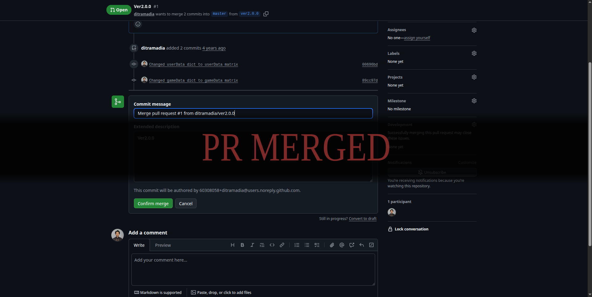

<div align="center">


<p align="center">
This extension brings the crushing weight and eventual triumph of a 'Souls-like' victory screen to your GitHub workflow.
</p>

<p align="center">

[](https://developer.mozilla.org/en-US/docs/Web/JavaScript)
[](https://developer.mozilla.org/en-US/docs/Web/CSS)

</p>

</div>

# ⚔️ What is this?

A cinematic tribute to the legendary hardcore RPG genre. Every time you successfully merge a Pull Request, you are greeted with a cinematic "PR MERGED" overlay and the iconic sound effect.

<div align="center">
  
</div>

# ✨ Features

* Cinematic Overlay: A full-screen "PR MERGED" message styled with the Cinzel font and a blood-red gradient.

* Sound Effect Audio: Plays a familiar, crushing sound effect variant upon a successful merge, signaling your hard-fought victory.

* Input Detection: Listens for "Confirm" clicks on Squash, Rebase, and standard Merges.

* Zero Interference: The overlay is non-blocking (pointer-events: none), so your browser remains functional while the drama unfolds.

# 📂 Project Structure

```text
ds-merge-pr/
└── src/
    ├── manifest.json      # Extension configuration
    ├── content.js         # The "Brain" (DOM manipulation & click logic)
    ├── styles.css         # The "Stage" (Animations & Souls-Like styling)
    └── assets/
        ├── sound-effect.mp3
        ├── icon64.png
        └── icon128.png
```

# 🛠️ Installation

Since this is a custom extension, you’ll need to load it manually in Developer Mode:

1. Download/Clone this repository to your local machine.

    ```bash
    git clone https://github.com/ditramadia/souls-merge-pr.git
    ```

2. Open Google Chrome and navigate to chrome://extensions/.

3. Enable Developer mode using the toggle in the top-right corner.

4. Click the Load unpacked button.

5. Select the `src/` folder from this project.

6. Head over to GitHub and finish a quest (merge a PR)!

# 📜 How it Works

The extension uses a Content Script that injects itself into github.com. It utilizes Event Delegation to monitor all button clicks. When it detects a click on a button containing confirmation text (like "Confirm squash and merge"), it triggers a JavaScript function to build and inject the CSS-animated overlay.

# ⚖️ Legal & Attribution

This is a non-commercial, open-source fan project created as a tribute to the "Souls-like" genre. 
- All visual styles and sound cues are inspired by the aesthetic of popular hardcore fantasy RPGs.
- This project is not affiliated with, endorsed by, or associated with any specific game studio or publisher.

# 🛡️ License

MIT — Go forth and merge, Unkindled one.
